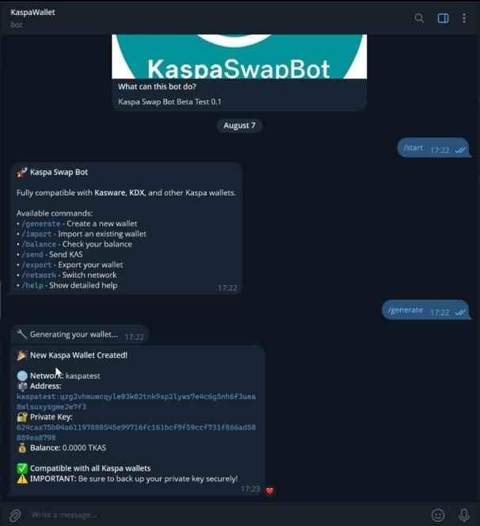
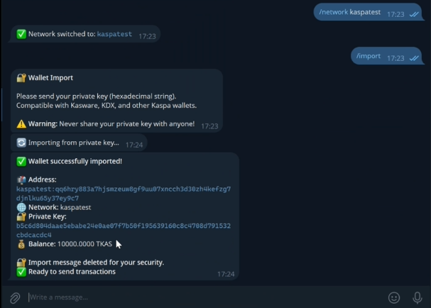
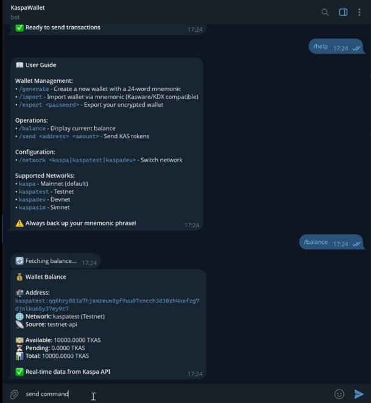

# 🚀 Kaspa Swap Bot

A simple and secure Telegram bot for managing your Kaspa wallets.



## ✨ What the bot does

- 🔐 **Creates Kaspa wallets** compatible with all wallets
- 📥 **Imports your existing wallets** (private key or mnemonic)
- 💰 **Checks your balance** in real-time
- 🌐 **Multi-network support** (Mainnet, Testnet)
- 🔄 **Sends transactions** with intelligent fallback
- ✅ **100% compatible** with Kasware, KDX, etc.

## 🎯 Main Commands

```
/start    - Start the bot and get welcome message
/generate - Create a new wallet with 24-word mnemonic
/import   - Import existing wallet (private key or mnemonic)
/network  - Switch between networks (kaspa/kaspatest/kaspadev)
/balance  - Check your current balance
/send     - Send KAS/TKAS transactions
/export   - Export your private key
/help     - Show detailed command help
```

## 🌐 Network Switching & Wallet Import



The bot supports multiple Kaspa networks and seamless wallet import:

| Network     | Description      | Currency | Command              |
| ----------- | ---------------- | -------- | -------------------- |
| `kaspa`     | Official Mainnet | KAS      | `/network kaspa`     |
| `kaspatest` | Test Network     | TKAS     | `/network kaspatest` |
| `kaspadev`  | Development      | DKAS     | `/network kaspadev`  |

## 📱 Help & Balance Information



Get comprehensive help and real-time balance checking across all supported networks.

## 🚀 Quick Installation

1. **Clone the project**

```bash
git clone https://github.com/SE-XPRT/KaspaSwapBot.git
cd KaspaSwapBot
```

2. **Install dependencies**

```bash
npm install
```

3. **Configure your Telegram token**

```bash
echo "BOT_TOKEN=your_token_here" > .env
```

4. **Start the bot**

```bash
npm start
```

## 🔐 Security & Compatibility

✅ **Private keys** never stored permanently  
✅ **Sensitive messages** automatically deleted  
✅ **Compatible** with Kasware, KDX, Tangem  
✅ **24-word mnemonics** BIP39 standard  
✅ **Multi-network** support (kaspa, kaspatest, kaspadev)

## 📱 How to Use

1. **Start** a conversation with the bot using `/start`
2. **Create** a new wallet with `/generate` or **import** your existing one with `/import`
3. **Switch networks** with `/network kaspatest` for testing
4. **Check** your balance with `/balance`
5. **Send** transactions easily with `/send <address> <amount>`
6. **Get help** anytime with `/help`

## 🆘 Support & Community

- 📧 **GitHub Issues** for bugs and feature requests
- 💬 **Discussions** for questions and ideas
- 📖 **Wiki** for detailed documentation
- 🌟 **Star the project** if you like it!

## 📄 License

MIT License - Feel free to use in your projects!

---

**Built with ❤️ for the Kaspa community**

## ✨ What the bot does

- 🔐 **Creates Kaspa wallets** compatible with all wallets
- 📥 **Imports your existing wallets** (private key or mnemonic)
- 💰 **Checks your balance** in real-time
- 🌐 **Multi-network support** (Mainnet, Testnet)
- � **Sends transactions** with intelligent fallback
- ✅ **100% compatible** with Kasware, KDX, etc.


## 🎯 Main Commands

```
/start    - Start the bot
/generate - Create a new wallet
/import   - Import an existing wallet
/balance  - Check your balance
/send     - Send KAS/TKAS
/export   - Export your private key
/network  - Switch networks
/help     - Show detailed help
```


## 🚀 Quick Installation

1. **Clone the project**

```bash
git clone https://github.com/SE-XPRT/KaspaSwapBot.git
cd KaspaSwapBot
```

2. **Install dependencies**

```bash
npm install
```

3. **Configure your Telegram token**

```bash
echo "BOT_TOKEN=your_token_here" > .env
```

4. **Start the bot**

```bash
npm start
```

**Ready to use!** Your bot is now running and ready to manage Kaspa wallets.

## 🔐 Security & Compatibility

✅ **Private keys** never stored permanently  
✅ **Sensitive messages** automatically deleted  
✅ **Compatible** with Kasware, KDX, Tangem  
✅ **24-word mnemonics** BIP39 standard  
✅ **Multi-network** support (kaspa, kaspatest, kaspadev)


## 🌐 Supported Networks

| Network     | Description      | Currency |
| ----------- | ---------------- | -------- |
| `kaspa`     | Official Mainnet | KAS      |
| `kaspatest` | Test Network     | TKAS     |
| `kaspadev`  | Development      | DKAS     |


## � How to Use

1. **Start** a conversation with the bot
2. **Create** a new wallet or **import** your existing one
3. **Check** your balance
4. **Send** transactions easily


## 🏗️ Architecture

### Clean & Modular Structure

```
kaspa-swap-bot/
├── lib/
│   ├── createWallet.js        # Wallet creation & utilities
│   ├── walletManager.js       # Transaction management
│   ├── privateKeyImport.js    # Private key derivation
│   └── apiTransactionSender.js # API fallback system
├── index.js                   # Main Telegram bot
└── package.json
```

### Key Features

- **Framework initialization** - Single init, reused across sessions
- **Private key derivation** - Real address derivation with kaspacore
- **API fallback system** - When RPC nodes are unavailable
- **Session management** - Secure temporary wallet storage

## � Advanced Usage

### Network Switching

```
/network kaspa      - Switch to Mainnet
/network kaspatest  - Switch to Testnet
/network kaspadev   - Switch to Devnet
```

### Transaction Examples

```
/send kaspa:qz123... 1.5       - Send 1.5 KAS on Mainnet
/send kaspatest:qq456... 10    - Send 10 TKAS on Testnet
```

## 🆘 Support & Community

- 📧 **GitHub Issues** for bugs and feature requests
- 💬 **Discussions** for questions and ideas
- 📖 **Wiki** for detailed documentation
- 🌟 **Star the project** if you like it!

## 📄 License

MIT License - Feel free to use in your projects!

---

**Built with ❤️ for the Kaspa community**


